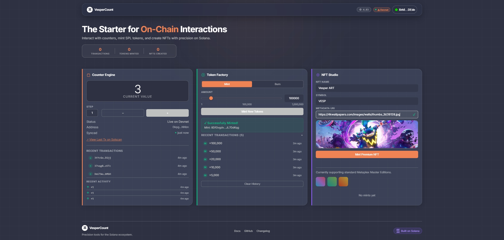

# VesperCount



A full-stack **Solana Decentralized Application (DApp)** built with the **Anchor** framework for on-chain programs (Rust) and **React + Vite** for the frontend (TypeScript).

This monorepo bundles three independent smart contract programs and a unified web interface to interact with all of them on the Solana **Devnet**.

---

## Architecture Overview

The project is split into two main layers: **Backend (Anchor Programs)** and **Frontend (React App)**.

### Backend — Smart Contracts (`/programs/`)

Three separate Anchor programs, each demonstrating a different pattern on Solana:

| Program | Description |
|---|---|
| `vespercount` | Stateful on-chain counter using **PDA** — supports initialize, increment, and decrement per wallet |
| `spl_token_minter` | Mint and burn **SPL Tokens** via Cross-Program Invocation (CPI) with the Token Program |
| `nft_minter` | Mint **Metaplex Master Edition NFTs** with on-chain metadata; includes a 0.05 SOL treasury fee per mint |

### Frontend — Web App (`/app/`)

A React + Vite + TypeScript application that connects to the deployed programs via Anchor's IDL. It features a modern, responsive design with a premium glassmorphism aesthetic and a dynamic sticky navbar.

- **Wallet Support:** Phantom & Solflare via `@solana/wallet-adapter-react`
- **Network:** Solana Devnet (configurable via `VITE_RPC_URL`)
- **App Features & Components:**
  - **Auto-Syncing Counter:** `<CounterCard />` interacts with the `vespercount` program.
  - **Token Management:** `<TokenCard />` mints and burns SPL Tokens via `spl_token_minter`.
  - **NFT Studio:** `<NftCard />` creates NFTs via `nft_minter`, featuring real-time metadata fetching and CORS-safe image previews.
  - **Responsive Layout:** A modular dashboard grid that symmetrically aligns the navbar, cards, and footer sections up to `1600px`.

---

## Directory Structure

```text
vespercount/
│
├── app/                                    # Frontend (React + Vite + TS)
│   ├── src/
│   │   ├── components/                     # Reusable UI components
│   │   │   ├── CounterCard.tsx
│   │   │   ├── NftCard.tsx
│   │   │   ├── ToastContext.tsx
│   │   │   ├── TokenCard.tsx
│   │   │   └── WalletButton.tsx
│   │   ├── hooks/                          # React hooks
│   │   │   ├── useCounter.ts
│   │   │   ├── useNft.ts
│   │   │   └── useToken.ts
│   │   ├── idl/                            # Generated IDL JSON files
│   │   ├── App.tsx                         # Root layout
│   │   ├── index.css                       # Global styles
│   │   └── main.tsx                        # Entry point
│   ├── index.html
│   ├── package.json
│   ├── package-lock.json
│   ├── tsconfig.json
│   └── vite.config.ts
│
├── migrations/                             # Anchor deployment scripts
│   └── deploy.ts
│
├── programs/                               # Rust smart contracts (Anchor)
│   ├── nft_minter/
│   │   └── src/lib.rs                      # NFTs with treasury fee
│   ├── spl_token_minter/
│   │   └── src/lib.rs                      # SPL token mint/burn logic
│   └── vespercount/
│       └── src/lib.rs                      # PDA counter logic
│
├── tests/                                  # Integration tests (ts-mocha)
│   ├── nft_minter.ts
│   ├── spl_token_minter.ts
│   └── vespercount.ts
│
├── .gitignore
├── Anchor.toml                             # Anchor workspace config
├── Cargo.lock
├── Cargo.toml
├── README.md                               # Project documentation
├── image.png                               # GitHub preview image
├── package.json
├── package-lock.json
├── run.txt                                 # Step-by-step setup guide
├── rust-toolchain.toml                     # Rust version specification
├── tsconfig.json
└── yarn.lock
```

---

## How It Works

```
1. Write smart contract logic in Rust  →  programs/<name>/src/lib.rs
           ↓
2. Compile with `anchor build`
           ↓
3. Anchor generates IDL (.json) + TypeScript types  →  target/idl/ & target/types/
           ↓
4. Frontend imports IDL  →  Creates typed Program instance via Anchor client
           ↓
5. User clicks button in React UI  →  Transaction built & signed by wallet (Phantom)
           ↓
6. Transaction sent to Solana Devnet  →  Smart contract executes on-chain
```

---

## Quick Start

See [`run.txt`](./run.txt) for the full step-by-step setup guide.

```bash
# Clone and install
git clone https://github.com/alfebrio/vespercount.git
cd vespercount
yarn install

# Build & deploy to Devnet
anchor build
anchor deploy

# Run frontend
cd app && npm install && npm run dev
```

---

## Tech Stack

| Layer | Technology |
|---|---|
| Smart Contracts | Rust, Anchor Framework |
| Blockchain | Solana (Devnet) |
| Frontend | React 18, Vite, TypeScript |
| Wallet | Solana Wallet Adapter (Phantom, Solflare) |
| NFT Standard | Metaplex Token Metadata (Master Edition V3) |
| Token Standard | SPL Token Program |
| Testing | ts-mocha, Chai |
